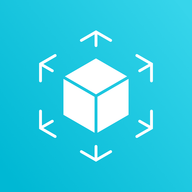
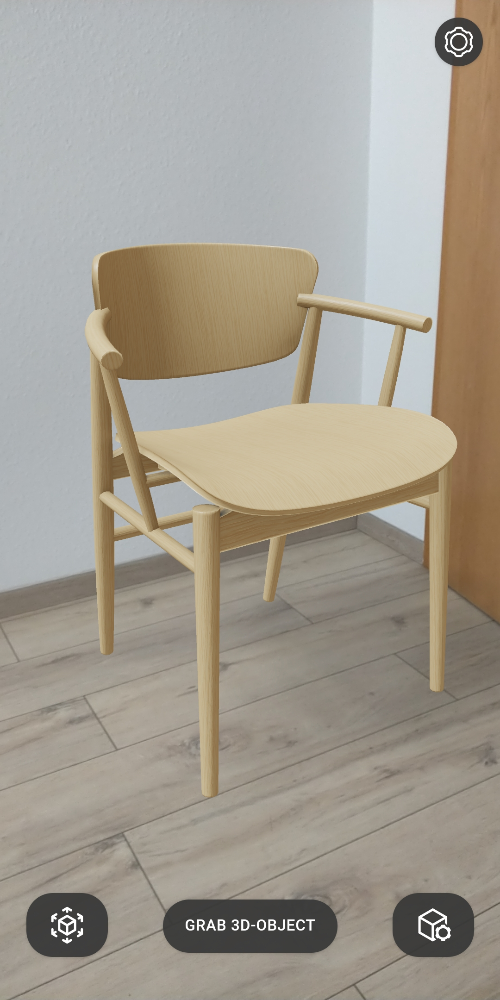
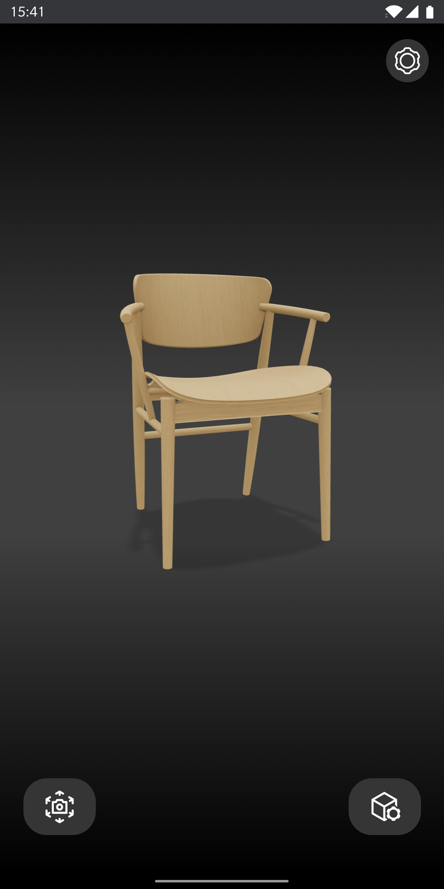
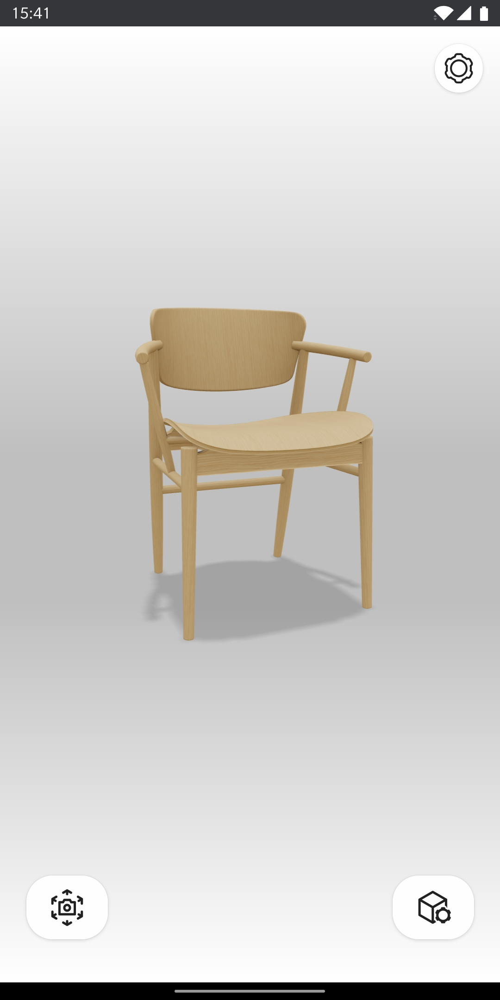
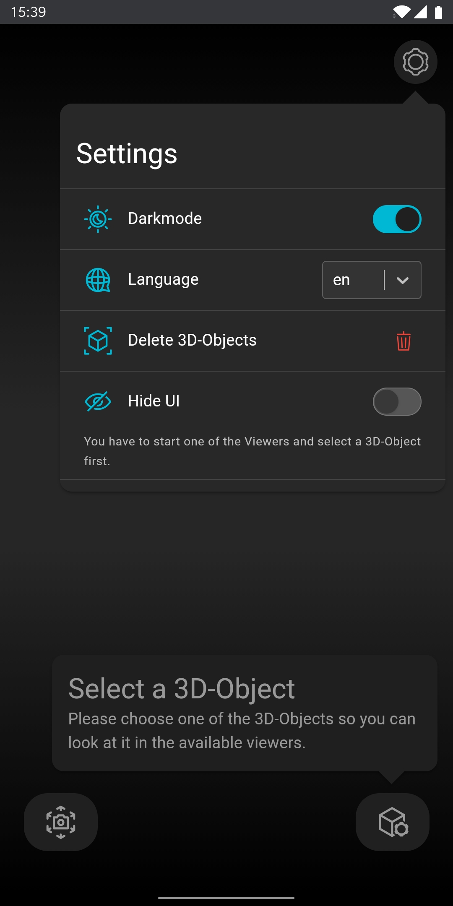
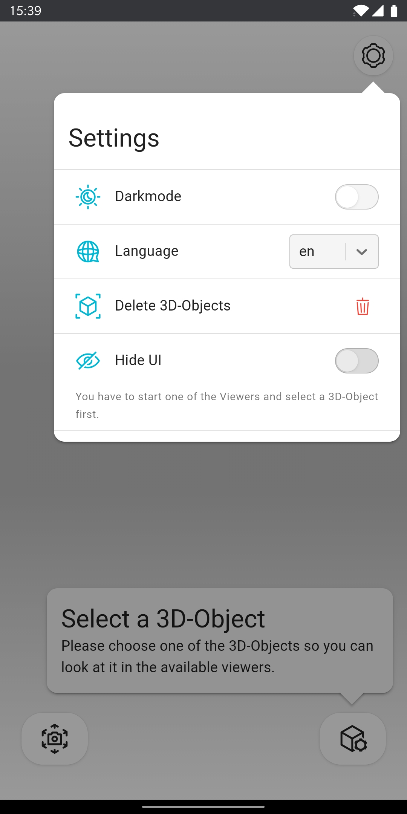
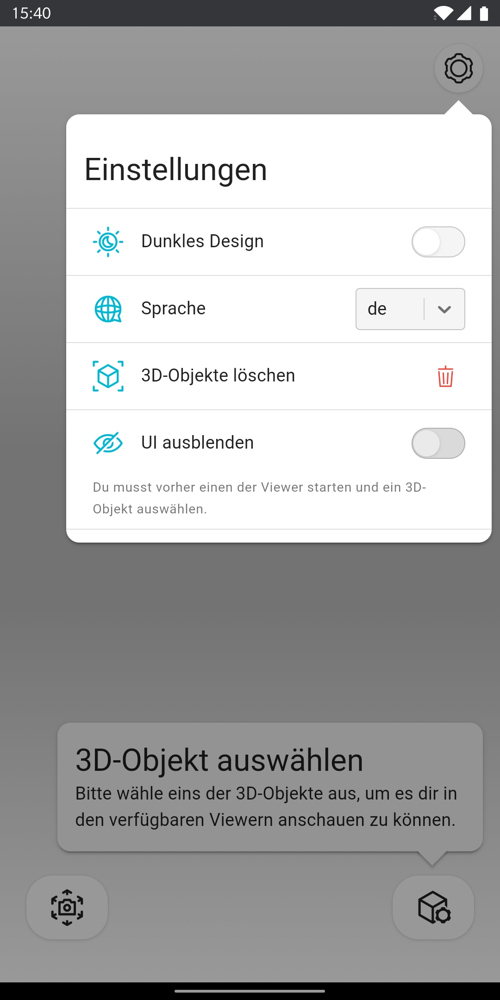
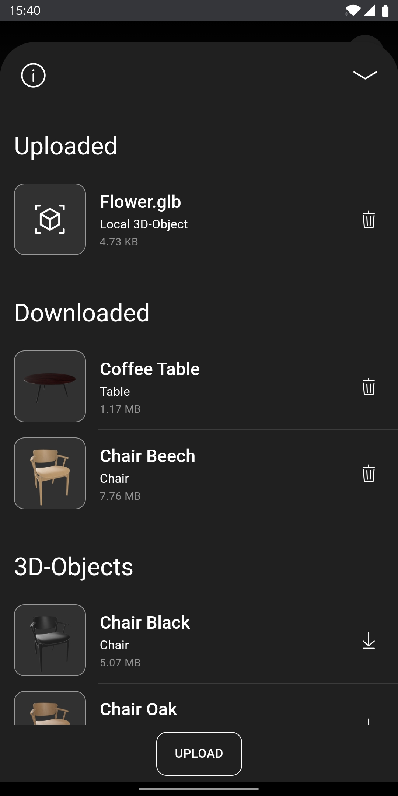
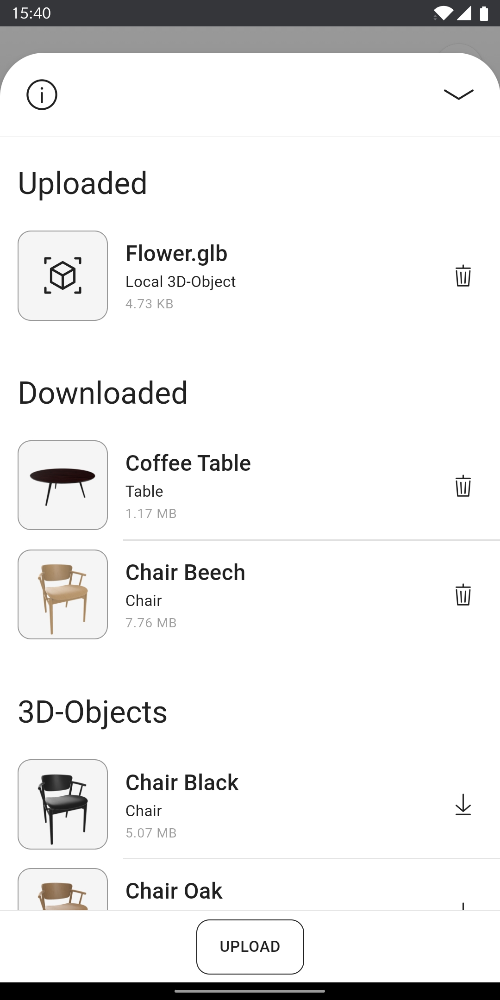

# AR-Viewer
<p align="center">

</p>

Augmented-Reality web-app build with PWA functionality using [React](https://reactjs.org/), [three.js](https://threejs.org/) and [WebXR](https://immersiveweb.dev/). It is downloadable through the used browser and offers extensive offline functionality.

A live demo is available [here](https://app-ar-viewer.vercel.app/).











Uses an AR-Viewer to place 3D-Objects around yourself through your device's camera and a regular 3D-Viewer as an alternative and fallback if your device doesn't support WebXR. Includes a selection of free 3D-Objects but also offers the functionality to upload your own local files (for now only in the .gltf/.glb file format). Supports light mode and dark mode as well as english and german as UI languages.

Currently support for WebXR and the included immersive-ar mode is pretty [limited](https://caniuse.com/webxr). So at the moment the only platform this app reliably works on with all features is Chrome for Android. When the WebXR API will be included into more browsers, compatibility for this app's AR-Viewer will also increase.

## Local Setup

As this app is intended as a downloadable PWA with offline functionality the default scripts use https since a secure connection is required for all PWA features.

### Installation

To run this app locally first clone the repository then install the dependencies:
```
git clone https://github.com/sergidomenechguzy/app-ar-viewer.git
cd app-ar-viewer
npm install
```

### Local Development

```
npm run start
```

### Build
```
npm run build
```
This creates your own production build into the `build` folder that can be served locally.

### Serve

```
npm run serve
```
This serves your current build locally over https. Works only after running `npm run build`.

To create a new build and instantly serve it:
```
npm run fresh
```

Note that for these commands to work you need to create your own `cert.pem` and `key.pem` files and add them in a `.cert` folder to the project root. This certificate is used to create the local https server. An easy way to create these files is to use [mkcert](https://github.com/FiloSottile/mkcert). Alternatively you can also use the [http scripts](#http).

### http

As an alternative to the https start, serve and fresh scripts, regular http versions exist as well:
```
npm run start:http
npm run serve:http
npm run fresh:http
```

## Included Assets

[Coaster](https://www.cgtrader.com/free-3d-models/furniture/tableware/cork-coaster-for-coffee-and-tea-cups), 
[Coffee Table](https://www.cgtrader.com/free-3d-models/furniture/table/round-wooden-coffee-table-2ce88b2c-9f04-465b-ae3c-adf51fec082d), 
[Pepper Grinder](https://www.cgtrader.com/free-3d-models/furniture/kitchen/pepper-grinder-3), 
[Pouf](https://www.cgtrader.com/free-3d-models/furniture/chair/single-pouf-moderno), 
[Scale](https://www.cgtrader.com/free-3d-models/interior/kitchen/scales-black), 
[Stool](https://www.cgtrader.com/free-3d-models/furniture/other/stool-3db388ec-3503-40a2-a695-42cb48a2ac31), 
[Wooden Chair 1](https://www.cgtrader.com/free-3d-models/furniture/chair/n01-chair), 
[Wooden Chair 2](https://www.cgtrader.com/free-3d-models/furniture/chair/simple-wooden-chair-ee79988c-bcb1-42c6-9ceb-2348bd3cb8fd)
